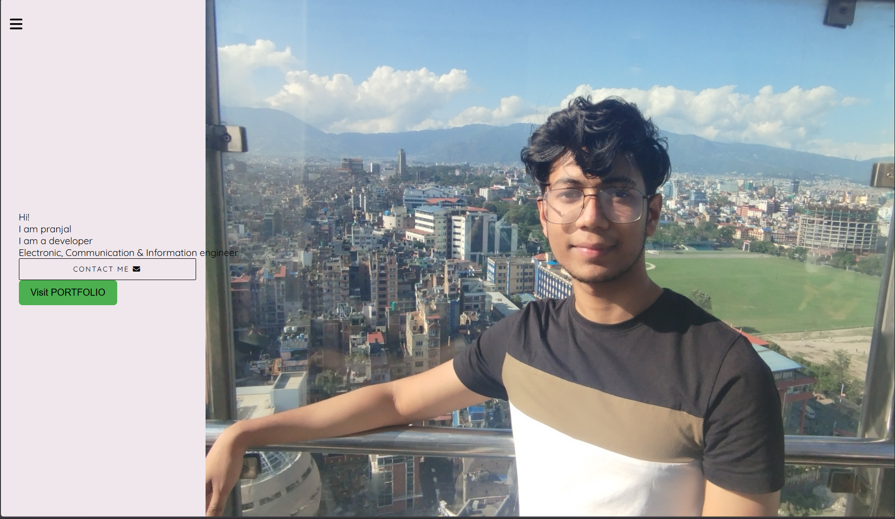

# Portfolio Website

A **mobile-first, responsive portfolio website** built mainly using **HTML and CSS**, with very minimal use of **JavaScript**.

---

## 📸 Screenshot



---

## 🛠 Technologies Used

* HTML5
* CSS3
* JavaScript (very minimal)

---

## 📁 File Structure

```
PORTFOLIO/
│── css/
│   ├── about.css
│   ├── common.css
│   ├── contact.css
│   ├── hero.css
│   ├── sidebar.css
│   ├── skills.css
│   └── work-count.css
│
│── images/
│   ├── p1.jpg
│   └── pic.jpg
│
│── globals.css
│── index.html
│── README.md
│── report.txt
│── .gitignore
```

---

## 📌 Sections Included

* Sidebar Navigation
* Hero Section
* About Section
* Skills Section
* Work Count Section
* Contact Section

---

## 🚀 How to Run

Just open **`index.html`** in any web browser
or use **Live Server** in VS Code.

---

## 🎯 Purpose

This project was created to practice **responsive design**, **HTML & CSS structuring**, and **GitHub usage**.

---

⭐ Simple, clean, and beginner-friendly portfolio project.
